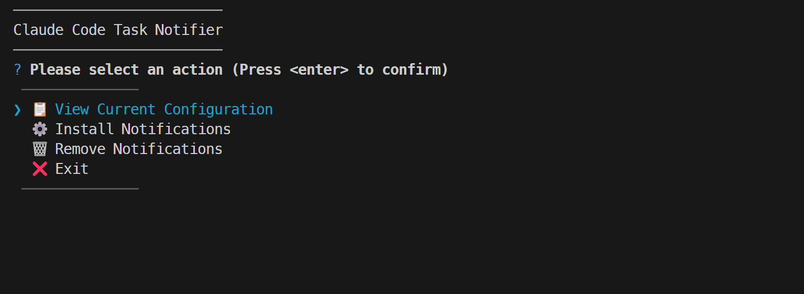
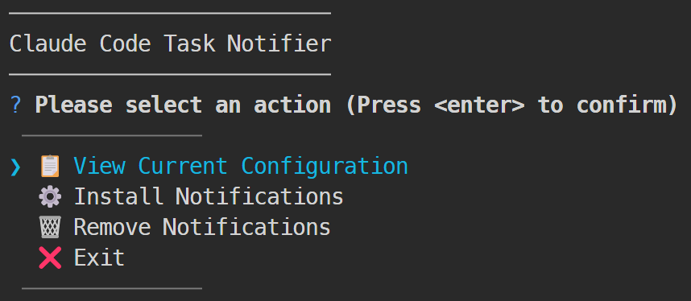
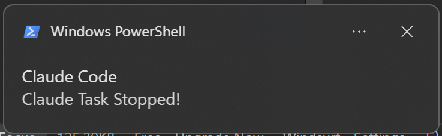

# Claude Code Task Notifier

> **Never miss when your AI tasks complete again!**

Get instant native desktop notifications when Claude Code tasks finish or stop. A modern TypeScript CLI with beautiful interactive interface and cross-platform support.

[](https://www.typescriptlang.org/)
[](https://nodejs.org/)
[](LICENSE)
[](http://makeapullrequest.com)

---

## 🎬 See It In Action

<div align="center">
  
  <br />
  <em>Installation process via npx, easy and quick</em>
</div>

<br />

<!-- Placeholder for demo images -->
<div align="center">
  
  <br />
  <em>Beautiful interactive interface with arrow-key navigation</em>
</div>

<br />

<div align="center">
  
  <br />
  <em>Native desktop notifications on Windows and macOS</em>
</div>

---

## ⚡ Quick Start

The easiest way to get started is by using `npx`. This will run the interactive setup without needing to clone or install anything.

Open your terminal and run:
```bash
npx claude-code-task-notifier
```

That's it! The tool will guide you through the rest.

---

## 💻 For Developers (Running from Source)

If you'd like to run the tool from the source code or contribute to development:

```bash
# 1. Clone the repository
git clone https://github.com/Roy-Tu/claude-code-task-notifier.git

# 2. Navigate into the directory
cd claude-code-task-notifier

# 3. Install dependencies
npm install

# 4. Run the application
npm start
```

---

## ✨ What This Tool Does

### 🎯 **The Problem**
Working with Claude Code but missing when tasks complete because you're in another app?

### 🚀 **The Solution**
- ✅ **Task completion notifications** - Know instantly when AI tasks finish
- 🛑 **Task stop alerts** - Get notified when tasks are cancelled
- 🔊 **Optional sound alerts** - Audio notifications on macOS
- 🖥️ **Cross-platform** - Works on Windows and macOS

---

## 🎛️ Features

### **Interactive Management**
- **📋 View Configuration** - Check current settings at a glance
- **⚙️ Install Notifications** - Easy setup with guided prompts
- **🗑️ Remove Notifications** - Clean removal of specific hooks
- **🔄 Arrow-key Navigation** - Consistent UX throughout

### **Smart & Secure**
- **🛡️ Input Sanitization** - All commands are safely generated
- **🔷 TypeScript First** - Full type safety and modern architecture
- **⚙️ Platform Detection** - Automatically adapts to your OS
- **💾 Persistent Settings** - Integrates with Claude Code's settings.json

### **Cross-Platform Support**
| Platform | Notifications | Sound | Implementation |
|----------|---------------|-------|---------------|
| **Windows** | ✅ Native | ❌ | PowerShell + WinForms |
| **macOS** | ✅ Native | ✅ | osascript + AppleScript |
| **Linux** | 🚧 Coming Soon | 🚧 | notify-send |

---

## 🎮 How It Works

### **1. Interactive Setup**
Run `npm start` to launch the beautiful CLI interface:

```
📋 View Current Configuration
⚙️ Install Notifications
🗑️ Remove Notifications
❌ Exit
```

### **2. Choose Your Notifications**
Select which events you want to be notified about:
- Task completion alerts
- Task stop/cancellation alerts

### **3. Sound Preferences** (macOS only)
Choose whether to include sound with your notifications.

### **4. Automatic Integration**
The tool safely updates your Claude Code `settings.json` with the notification hooks.

---

## 📋 Requirements

- **Node.js** 18.0.0 or higher
- **Claude Code** (properly installed)
- **Windows** (PowerShell) or **macOS** (osascript)

---

## 📚 Documentation

- **[🏗️ Architecture](docs/ARCHITECTURE.md)** - Technical implementation details
- **[💻 Development](docs/DEVELOPMENT.md)** - Local development setup

---

## 🌟 Why Choose This Tool?

### **For Developers**
- **Stay Productive** - Work in other apps without missing task completions
- **Focus Mode** - No need to constantly check Claude Code status
- **Zero Configuration** - Works out of the box with smart defaults

### **For Teams**
- **Shared Workflows** - Team members know when AI tasks complete
- **Collaborative AI** - Better coordination on shared AI projects
- **Professional Integration** - Enterprise-grade security and reliability

### **Technical Excellence**
- **Modern TypeScript** - Strict typing and latest language features
- **Security First** - All user inputs sanitized, no code injection risks
- **Clean Architecture** - Modular, testable, and maintainable code
- **Cross-Platform** - Native implementation for each operating system

---

## 🤝 Contributing

We welcome contributions!

**Quick ways to help:**
- 🐛 [Report bugs](https://github.com/Roy-Tu/claude-code-task-notifier/issues)
- 💡 [Request features](https://github.com/Roy-Tu/claude-code-task-notifier/discussions)
- 🔧 [Submit pull requests](https://github.com/Roy-Tu/claude-code-task-notifier/pulls)
- 📖 [Improve documentation](docs/)

---

## 📄 License

MIT License - see [LICENSE](LICENSE) for details.

---

<div align="center">

**⭐ If this tool helps your workflow, please give it a star!**

[📱 View Demo](docs/images/) • [🐛 Report Bug](https://github.com/Roy-Tu/claude-code-task-notifier/issues) • [💬 Discussions](https://github.com/Roy-Tu/claude-code-task-notifier/discussions)

---

*Made with ❤️ for the Claude Code community*

</div>